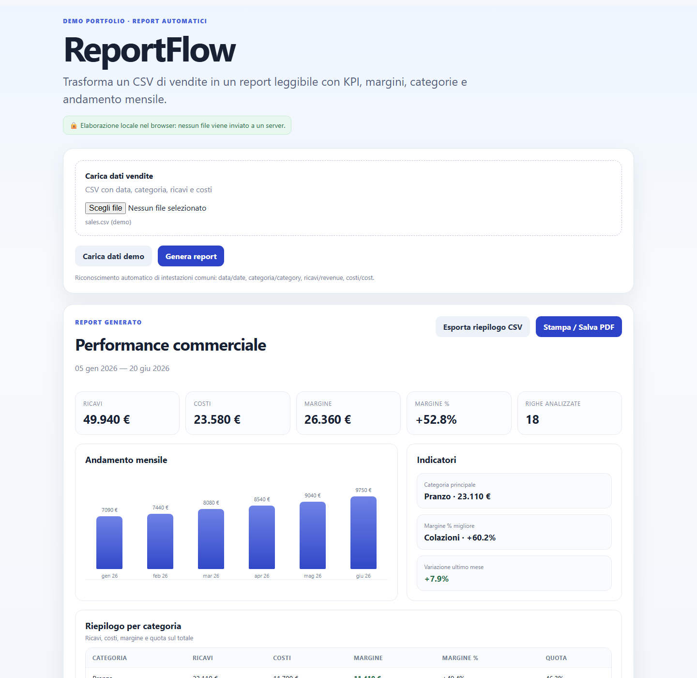

# ReportFlow

Demo portfolio per trasformare un CSV di vendite in un report automatico con KPI, margini, andamento mensile e riepilogo per categoria.

**Demo online:** https://ago993.github.io/reportflow-demo/

## Funzioni

- caricamento CSV;
- riconoscimento automatico delle colonne principali;
- KPI di ricavi, costi, margine e margine percentuale;
- andamento mensile;
- riepilogo per categoria;
- indicatori sintetici;
- esportazione del riepilogo in CSV;
- stampa / salvataggio PDF tramite browser.

## Privacy

I dati vengono elaborati interamente nel browser. La demo non invia i file a un backend.

## Formato dati

Sono richieste colonne equivalenti a:

- data / date;
- categoria / category;
- ricavi / revenue / vendite;
- costi / cost / spese.

## Avvio locale

```bash
python -m http.server 8010
```

Poi apri `http://localhost:8010/?demo=1`.

## Test

```bash
node tests/test_core.js
```

## Stack

HTML, CSS e JavaScript puro. Nessuna dipendenza runtime.

## Nota

Questa è una demo dimostrativa. In un progetto reale il report verrebbe adattato a KPI, regole, formati file e layout richiesti dal cliente.


